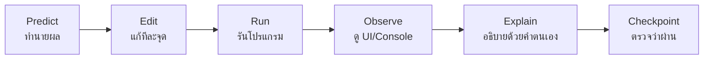

# ENGSE203 Week 04 — React Beginner Bridge Pack

เอกสารชุดนี้เป็นสะพานจาก Week 03 ซึ่งใช้ HTML/CSS/Vanilla JavaScript ไปสู่ React + JSX สำหรับผู้เรียนที่ยังไม่เคยเขียน React มาก่อน โดยปลายทางคือการทำ Pre-LAB04 และ LAB04 ได้ด้วยความเข้าใจ ไม่ใช่การคัดลอกโค้ด

## ผลลัพธ์ที่ต้องทำได้

เมื่อเรียนครบ ผู้เรียนจะสามารถ:

1. อธิบายความต่างระหว่างการแก้ DOM โดยตรงกับ State-driven UI
2. อ่านและเขียน JSX ขั้นพื้นฐาน
3. แยก UI เป็น Functional Components ตามความรับผิดชอบ
4. ส่งข้อมูลด้วย Props และส่งเหตุการณ์กลับด้วย Callback
5. ใช้ `useState()` จัดการข้อมูลที่เปลี่ยนแล้วทำให้ UI render ใหม่
6. สร้าง list, filter, empty state และ Controlled Form
7. ประยุกต์ pattern จาก Study Task Board ไปยัง Campus Service Request
8. ตรวจ build และส่ง LAB04 ใน Student Repository เดียว

## วิธีใช้เอกสาร

อย่าอ่านรวดเดียวทั้งชุด ให้ทำแต่ละบทด้วยวงจรต่อไปนี้

หลักสำคัญคือ หลังคัดลอกตัวอย่างต้องอธิบายได้ว่า “ข้อมูลอยู่ที่ใด ไหลไปทางไหน และเหตุการณ์ใดทำให้ state เปลี่ยน”

## ลำดับไฟล์

| ลำดับ | เอกสาร | จุดหมาย |
|---:|---|---|
| 01 | [Mental Model](./01_WEEK03_TO_REACT_MENTAL_MODEL_TH.md) | เปลี่ยนวิธีคิดจาก DOM-driven เป็น State-driven |
| 02 | [React/Vite First App](./02_REACT_VITE_FIRST_APP_TH.md) | รัน React และเข้าใจเส้นทางไฟล์ |
| 03 | [JSX Fundamentals](./03_JSX_FUNDAMENTALS_TH.md) | เขียน JSX ที่ถูกต้อง |
| 04 | [Functional Components](./04_FUNCTIONAL_COMPONENTS_TH.md) | แบ่ง UI ตาม responsibility |
| 05 | [Props and Data Flow](./05_PROPS_AND_ONE_WAY_DATA_FLOW_TH.md) | ส่งข้อมูลลงและ event ขึ้น |
| 06 | [State and Events](./06_STATE_AND_EVENTS_TH.md) | ทำ UI ให้โต้ตอบได้ |
| 07 | [List, Key, Conditional](./07_LIST_KEY_CONDITIONAL_RENDERING_TH.md) | render/กรองรายการและ empty state |
| 08 | [Controlled Form](./08_CONTROLLED_FORM_VALIDATION_TH.md) | รับข้อมูลและ validate |
| 09 | [Guided Study Task Board](./09_STUDY_TASK_BOARD_GUIDED_BUILD_TH.md) | รวมทักษะเป็น CP00–CP07 |
| 10 | [Transfer to LAB04](./10_TRANSFER_TO_LAB04_CAMPUS_SERVICE_REQUEST_TH.md) | ประยุกต์กับโจทย์จริง |
| 11 | [Test, Build, Pages, Submit](./11_TEST_BUILD_PAGES_SUBMISSION_TH.md) | ตรวจและส่งผ่าน repo เดียว |
| 12 | [Troubleshooting](./12_REACT_BEGINNER_TROUBLESHOOTING_TH.md) | วิเคราะห์ error อย่างเป็นขั้นตอน |

## แผนเวลา Pre-LAB 240 นาที

| Checkpoint | เวลา | ผลลัพธ์ |
|---|---:|---|
| CP00 First React Success | 15 นาที | React/Vite รันได้และเห็น HMR |
| CP01 JSX และ Components | 30 นาที | แยก component แรก |
| CP02 Props, List และ Key | 35 นาที | แสดงข้อมูลจาก array |
| CP03 State และ Derived Data | 40 นาที | filter/count เปลี่ยนตาม state |
| CP04 Controlled Form | 50 นาที | เพิ่มข้อมูลและ validate ได้ |
| CP05 Callback/Delete | 35 นาที | ลบรายการและเห็น empty state |
| CP06 Responsive/A11y | 20 นาที | ใช้ได้ที่ 375px และด้วย keyboard |
| CP07 Verify/Transfer | 15 นาที | build ผ่านและวางแผน LAB04 |
| **รวม** | **240 นาที** | |

## Repository Contract ที่ใช้

Week 04 ใช้ Student Repository เดียวกับ LAB01–LAB03

| รายการ | ค่า |
|---|---|
| Repository | `engse203-student-labs-<student-id>` |
| Branch | `lab/week-04` |
| Source | `labs/week-04/source/` |
| Evidence | `labs/week-04/evidence/` |
| Publish input | `labs/week-04/publish/` |
| Pages result | `docs/labs/week-04/` |
| Tag | `lab-04-submission-v1` |

## ขอบเขต

Week 04 เรียน JSX, Components, Props, State, Events, List, Controlled Form, Validation, Responsive UI และการส่งงาน

ยังไม่เรียน React Router, `useEffect()` เชิงลึก, API fetching เต็มรูปแบบ, LocalStorage, Database, Context, Redux/Zustand หรือ Authentication หัวข้อเหล่านี้เป็น preview สำหรับสัปดาห์ถัดไป

## การใช้ AI อย่างรับผิดชอบ

- ใช้ AI ช่วยอธิบาย error หรือเสนอทางเลือกได้
- ต้องอ่าน diff, รัน test และอธิบายโค้ดที่นำมาใช้ได้
- ห้ามส่งโค้ดที่ไม่เคยรันหรือไม่เข้าใจ
- บันทึก AI disclosure ใน README ของ LAB04 ตามที่ผู้สอนกำหนด

## Definition of Done ของ Bridge Pack

- [ ] ทำ CP00–CP07 ตามลำดับ
- [ ] อธิบาย State owner, Props และ Callback ได้
- [ ] `npm run check` และ `npm run build` ผ่านใน Pre-LAB
- [ ] เติม Transfer Matrix ก่อนเริ่ม LAB04
- [ ] ไม่คัดลอกชื่อ field/component จาก Task Board ไปเปลี่ยนชื่อเพียงอย่างเดียว

เริ่มที่ [01 — จาก Week 03 สู่ React Mental Model](./01_WEEK03_TO_REACT_MENTAL_MODEL_TH.md)

ข้อมูลเวอร์ชันและรายการไฟล์: [Package Manifest](./PACKAGE_MANIFEST.md)
