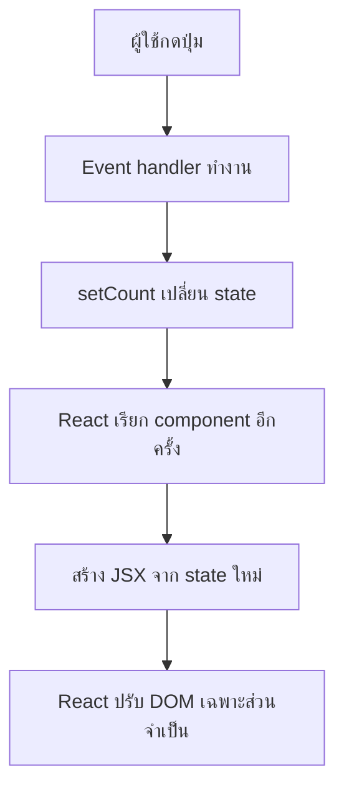

# 01 — จาก Week 03 สู่ React Mental Model

## เป้าหมาย

หลังจบบทนี้ ผู้เรียนจะอธิบายได้ว่า React ไม่ได้เริ่มจาก syntax ใหม่ แต่เริ่มจากวิธีคิดใหม่: เราเปลี่ยนข้อมูลใน state แล้วให้ React คำนวณ UI ที่ควรแสดง

## สิ่งที่คุ้นจาก Week 03

ใน Vanilla JavaScript เรามักเขียนแบบนี้:

```js
const countElement = document.querySelector('#count');
const addButton = document.querySelector('#add-button');

let count = 0;

addButton.addEventListener('click', () => {
  count += 1;
  countElement.textContent = count;
});
```

โค้ดนี้มีสองงานที่ผู้เขียนต้องรับผิดชอบเอง:

1. เปลี่ยนข้อมูล `count`
2. สั่งแก้ DOM ด้วย `textContent`

ถ้า UI มี count, list, filter และ form หลายส่วน เราต้องจำว่าเมื่อข้อมูลเปลี่ยน ต้องแก้ DOM จุดใดบ้าง

## วิธีคิดของ React

ใน React เราเขียนความสัมพันธ์ว่า UI ควรมีหน้าตาอย่างไรจาก state ปัจจุบัน

```jsx
import { useState } from 'react';

function Counter() {
  const [count, setCount] = useState(0);

  return (
    <button type="button" onClick={() => setCount((current) => current + 1)}>
      จำนวนครั้ง: {count}
    </button>
  );
}
```

เมื่อเรียก `setCount()`:



ผู้เขียนจึงเน้นที่:

```text
UI = function(state)
```

ไม่ใช่ “เมื่อเกิดเหตุการณ์นี้ ต้องไปแก้ DOM จุด A, B และ C”

## เปรียบเทียบสองแบบ

| ประเด็น | Week 03: DOM-driven | Week 04: React State-driven |
|---|---|---|
| แหล่งข้อมูล | ตัวแปรและค่าบน DOM อาจแยกกัน | State เป็นแหล่งข้อมูลหลัก |
| เปลี่ยน UI | สั่ง `textContent`, `classList`, `innerHTML` | เปลี่ยน state แล้ว React render |
| เหตุการณ์ | `addEventListener()` | JSX props เช่น `onClick` |
| แบบฟอร์ม | อ่านค่าจาก DOM เมื่อต้องการ | ผูก `value` กับ state |
| รายการ | ต่อ string/สร้าง element เอง | ใช้ `array.map()` คืน JSX |
| การแบ่งงาน | function/DOM section | component ตาม responsibility |

## ทดลอง: Predict → Observe

อ่านโค้ดต่อไปนี้ก่อนรัน

```jsx
let score = 0;

function ScoreBoard() {
  function handleAdd() {
    score += 1;
    console.log(score);
  }

  return <button onClick={handleAdd}>คะแนน {score}</button>;
}
```

ทำนาย:

1. Console เปลี่ยนหรือไม่
2. ข้อความบนปุ่มเปลี่ยนหรือไม่

คำตอบคือ Console เปลี่ยน แต่ UI อาจไม่เปลี่ยน เพราะตัวแปรธรรมดาไม่ได้แจ้ง React ให้ render ใหม่ นี่คือเหตุผลที่ข้อมูลซึ่งมีผลต่อ UI ต้องเป็น state

แก้เป็น:

```jsx
const [score, setScore] = useState(0);

function handleAdd() {
  setScore((currentScore) => currentScore + 1);
}
```

## หลักคิด 4 ข้อ

1. **State คือข้อมูลที่เปลี่ยนและมีผลต่อ UI**
2. **JSX คือคำอธิบาย UI จากข้อมูล ณ เวลานั้น**
3. **Props คือข้อมูล read-only ที่ Parent ส่งลง Child**
4. **Event/Callback คือสัญญาณที่ Child ส่งกลับเพื่อขอให้ owner เปลี่ยน state**

## เชื่อมกับ Campus Service Request

ใน LAB04:

- `requests` เป็น state หลัก
- `statusFilter` เป็น state ของตัวกรอง
- จำนวน pending/completed คำนวณจาก `requests` จึงเป็น derived data
- `RequestCard` ไม่ควรลบข้อมูลเอง แต่เรียก callback ส่ง `id` กลับไปยัง `App`

## Check Understanding

ตอบโดยไม่ดูข้อความด้านบน:

1. เหตุใด `document.querySelector()` จึงไม่ใช่วิธีหลักในการเปลี่ยน React UI
2. ตัวแปรธรรมดากับ state ต่างกันอย่างไร
3. Summary count ควรเก็บเป็น state แยกจาก requests หรือไม่ เพราะอะไร

## Mini Challenge

เขียน pseudocode 4 บรรทัดสำหรับ flow “ผู้ใช้ลบคำร้อง” โดยใช้คำว่า Event → Callback → State → Render

## Checkpoint

ผ่านบทนี้เมื่อสามารถวาด flow ต่อไปนี้จากความจำ:

```text
User action → event handler → state update → re-render → updated UI
```

ต่อไป: [02 — React/Vite First App](./02_REACT_VITE_FIRST_APP_TH.md)
