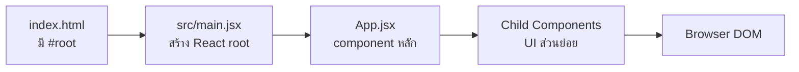

# 02 — React/Vite First App

## เป้าหมาย

ผู้เรียนสามารถเปิด starter, รัน development server, อธิบายเส้นทาง `index.html → main.jsx → App.jsx` และสังเกต Hot Module Replacement (HMR)

## เครื่องมือที่ใช้

- Node.js `>=22.12.0`
- npm
- Git
- VS Code
- Browser + DevTools Console

ตรวจเวอร์ชัน:

```bash
node --version
npm --version
git --version
```

บน Windows ให้เปิด repository ผ่าน VS Code Remote — WSL และวาง project ใน `~/projects` แทน `/mnt/c` เพื่อให้การติดตั้งและ file watching เสถียรกว่า

## เริ่มจาก starter ของรายวิชา

สำหรับคาบจริงให้ใช้ `pre-lab04/starter` ที่ผู้สอนแจก ไม่ต้องสร้าง Vite project ใหม่ เพื่อให้ version, scripts และ checkpoint ตรงกัน

```bash
cp -R <course-repo>/labs/week-04-react-components-state/pre-lab04/starter \
  ~/projects/engse203-prelab04
cd ~/projects/engse203-prelab04
npm install
npm run dev
```

เปิด URL ที่ Vite แสดง เช่น `http://localhost:5173`

## เส้นทางการเริ่ม application



`index.html` มีจุดยึด:

```html
<div id="root"></div>
<script type="module" src="/src/main.jsx"></script>
```

`src/main.jsx` นำ `App` ไป render:

```jsx
import { StrictMode } from 'react';
import { createRoot } from 'react-dom/client';
import App from './App.jsx';
import './styles.css';

createRoot(document.getElementById('root')).render(
  <StrictMode>
    <App />
  </StrictMode>,
);
```

`src/App.jsx` อธิบาย UI หลัก:

```jsx
function App() {
  return (
    <main>
      <h1>Study Task Board</h1>
      <p>React app แรกของฉันทำงานแล้ว</p>
    </main>
  );
}

export default App;
```

## ทดลอง HMR

1. เปิด `src/App.jsx`
2. เปลี่ยนข้อความใน `<p>`
3. บันทึกไฟล์
4. สังเกตว่า browser เปลี่ยนโดยไม่ต้องกด reload

HMR ช่วยให้เห็นผลระหว่างพัฒนา แต่ไม่ได้แทน production build ซึ่งต้องตรวจอีกครั้งใน CP07

## อธิบายคำสำคัญ

| คำ | ความหมายในบทนี้ |
|---|---|
| Vite | Development server และ build tool |
| React | Library สำหรับสร้าง UI จาก components/state |
| JSX | Syntax ที่เขียน markup ภายใน JavaScript |
| Entry point | ไฟล์เริ่มต้น เช่น `main.jsx` |
| Component | Function ที่คืน JSX |
| HMR | อัปเดต module ระหว่างพัฒนาอย่างรวดเร็ว |

## Check Understanding

1. ถ้าลบ `<div id="root">` จะเกิดอะไรขึ้น
2. เหตุใด `App.jsx` จึงต้อง `export default App`
3. Development server กับ production build ต่างกันอย่างไร

## Common Errors

### `npm: command not found`

Node.js ยังไม่พร้อม ให้ตรวจการติดตั้งหรือ `nvm use`

### Port 5173 ถูกใช้

```bash
npm run dev -- --port 5174
```

### หน้าเปล่า

เปิด Console แล้วแก้ error แรกก่อน ตรวจ:

- ชื่อไฟล์และตัวพิมพ์เล็ก/ใหญ่
- path ใน `import`
- tag JSX ปิดครบ
- `export default`

### แก้ไฟล์แล้วหน้าไม่เปลี่ยน

ตรวจว่าแก้ project ที่กำลังรันจริง และ terminal ไม่มี compile error

## CP00 — First React Success

ผ่านเมื่อ:

- [ ] `npm run dev` ทำงาน
- [ ] หน้า Study Task Board แสดง
- [ ] เปลี่ยน subtitle แล้ว HMR ทำงาน
- [ ] Console ไม่มี error สีแดง
- [ ] อธิบาย `index.html → main.jsx → App.jsx` ได้

ต่อไป: [03 — JSX Fundamentals](./03_JSX_FUNDAMENTALS_TH.md)
