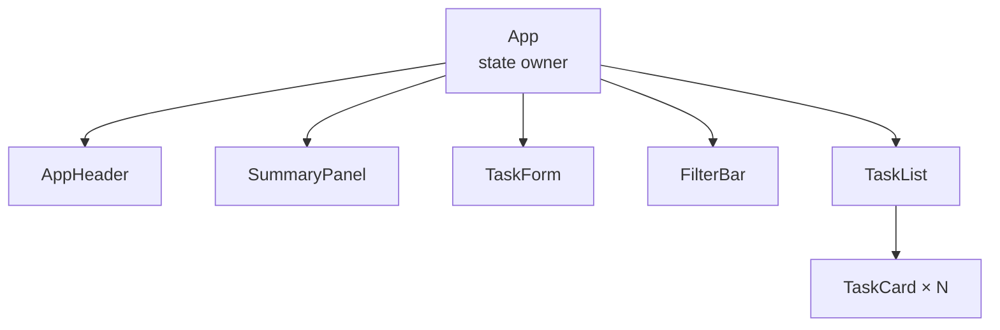

# 04 — Functional Components

## เป้าหมาย

ผู้เรียนสามารถแยก UI เป็น component ตามความรับผิดชอบ ตั้งชื่อให้สื่อความหมาย และเชื่อมไฟล์ด้วย `import`/`export`

## Component คืออะไร

Functional Component คือ JavaScript function ที่ชื่อขึ้นต้นด้วยตัวพิมพ์ใหญ่และคืน JSX

```jsx
function AppHeader() {
  return (
    <header className="hero">
      <h1>Study Task Board</h1>
      <p>ฝึก React ทีละ checkpoint</p>
    </header>
  );
}

export default AppHeader;
```

การใช้ component:

```jsx
import AppHeader from './components/AppHeader.jsx';

function App() {
  return (
    <>
      <AppHeader />
      <main>...</main>
    </>
  );
}
```

## อย่าแยกทุก `div`

เกณฑ์แยก component ที่เหมาะสม:

- มี responsibility ที่ตั้งชื่อได้
- ใช้ซ้ำได้หรือมีโอกาสใช้ซ้ำ
- รับข้อมูล/เหตุการณ์ผ่าน contract ชัดเจน
- ส่วนหนึ่งยาวหรือซับซ้อนจนทำให้ parent อ่านยาก
- ต้องทดสอบหรือแก้ไขแยกจากส่วนอื่น

ตัวอย่าง “CardHeaderLeft” อาจละเอียดเกินไป หากไม่มี behavior หรือ responsibility แยกจริง

## Component Tree ของ Study Task Board



`App` ทำหน้าที่ประกอบภาพรวมและเป็น owner ของข้อมูลหลัก ส่วน child components รับงานที่เฉพาะเจาะจง

## ขั้นตอนแยก `AppHeader`

### Step 1 — ระบุขอบเขต

ใน `App.jsx` หา markup ที่มี title และ subtitle

### Step 2 — สร้างไฟล์

`src/components/AppHeader.jsx`

```jsx
function AppHeader() {
  return (
    <header className="hero">
      <div className="container">
        <p className="eyebrow">ENGSE203 • PRE-LAB 04</p>
        <h1>Study Task Board</h1>
        <p>ฝึก React mental model ก่อนทำ LAB04</p>
      </div>
    </header>
  );
}

export default AppHeader;
```

### Step 3 — Import และใช้

```jsx
import AppHeader from './components/AppHeader.jsx';

function App() {
  return (
    <>
      <AppHeader />
      <main className="container page-content">...</main>
    </>
  );
}
```

### Step 4 — Run และตรวจ

- UI ควรเหมือนเดิม
- Console ไม่มี error
- `App.jsx` อ่านง่ายขึ้น

การ refactor ที่ดีเปลี่ยนโครงสร้างโค้ดโดยไม่เปลี่ยน behavior

## สร้าง `SummaryPanel`

ในขั้นแรกให้ใช้ค่าคงที่เพื่อเน้น component structure:

```jsx
function SummaryPanel() {
  return (
    <section className="panel" aria-labelledby="summary-title">
      <h2 id="summary-title">ภาพรวม</h2>
      <p>ทั้งหมด 3 รายการ</p>
    </section>
  );
}

export default SummaryPanel;
```

บทถัดไปจะเปลี่ยนค่าคงที่เป็น Props และภายหลังจะคำนวณจาก State

## Import/Export ที่พบบ่อย

Default export:

```jsx
export default TaskCard;
import TaskCard from './TaskCard.jsx';
```

Named export:

```jsx
export const initialTasks = [];
import { initialTasks } from './data/initialTasks.js';
```

วงเล็บปีกกาของ named import ต้องตรงกับชื่อ export

## Check Understanding

1. เหตุใดชื่อ component ต้องขึ้นต้นด้วยตัวพิมพ์ใหญ่
2. `App` ควรเก็บรายละเอียด markup ของทุก card หรือไม่
3. การแยก component ที่ดีควรรักษา behavior เดิมอย่างไร

## Mini Challenge

แยกส่วน filter ที่มี `<label>` และ `<select>` เป็น `FilterBar` โดยยังไม่ต้องมี state

## CP01 — JSX และ Components

ผ่านเมื่อ:

- [ ] มี `AppHeader` และ `SummaryPanel`
- [ ] import/export ถูกต้อง
- [ ] UI ยังแสดงเหมือนเดิม
- [ ] component แต่ละตัวมี responsibility ที่อธิบายได้
- [ ] Console ไม่มี error

ต่อไป: [05 — Props and One-way Data Flow](./05_PROPS_AND_ONE_WAY_DATA_FLOW_TH.md)
