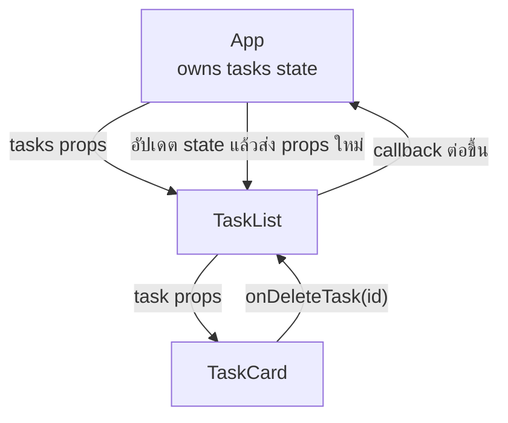

# 05 — Props and One-way Data Flow

## เป้าหมาย

ผู้เรียนสามารถส่งข้อมูลจาก Parent ไป Child ด้วย Props และอธิบายได้ว่า Child ไม่ควรแก้ Props โดยตรง

## Props คือ Component Contract

Parent ระบุข้อมูลที่ Child ต้องใช้:

```jsx
<AppHeader
  title="Study Task Board"
  subtitle="ฝึก React mental model ก่อนทำ LAB04"
/>
```

Child รับข้อมูล:

```jsx
function AppHeader({ title, subtitle }) {
  return (
    <header className="hero">
      <h1>{title}</h1>
      <p>{subtitle}</p>
    </header>
  );
}
```

Props เป็น read-only input หาก Child ต้องการให้ข้อมูลหลักเปลี่ยน Child จะเรียก callback ที่ Parent ส่งมา

## One-way Data Flow



จำเป็นประโยคเดียว:

```text
Data flows down; events flow up.
```

## ส่ง Object Props

```jsx
const task = {
  id: 'TASK-001',
  title: 'อ่านบท JSX',
  status: 'todo',
};

<TaskCard task={task} />
```

```jsx
function TaskCard({ task }) {
  return (
    <article className="task-card">
      <h3>{task.title}</h3>
      <p>สถานะ: {task.status}</p>
    </article>
  );
}
```

## Props ไม่ใช่ State

ตัวอย่างที่ไม่ควรทำ:

```jsx
function TaskCard({ task }) {
  task.status = 'done';
  return <p>{task.status}</p>;
}
```

การแก้ object ที่รับจาก Parent ทำให้ data flow คาดเดายาก และอาจเป็นการ mutate state ของ Parent ทางอ้อม

## Callback Prop

Parent:

```jsx
function App() {
  function handleDeleteTask(taskId) {
    console.log('ต้องการลบ', taskId);
  }

  return <TaskCard task={task} onDeleteTask={handleDeleteTask} />;
}
```

Child:

```jsx
function TaskCard({ task, onDeleteTask }) {
  return (
    <article>
      <h3>{task.title}</h3>
      <button type="button" onClick={() => onDeleteTask(task.id)}>
        ลบ
      </button>
    </article>
  );
}
```

เหตุผลที่ใช้ arrow function:

```jsx
onClick={() => onDeleteTask(task.id)}
```

คือเราต้องการให้ React เรียก callback เมื่อกด และต้องการส่ง `task.id` ไปด้วย

## ขั้นทดลอง

1. **Predict:** ถ้าเปลี่ยน title ที่ Parent ส่งมา Child จะเปลี่ยนหรือไม่
2. **Edit:** เปลี่ยน `"Study Task Board"` เป็น `"My Study Tasks"`
3. **Run:** ดู HMR
4. **Observe:** UI จุดใดเปลี่ยน
5. **Explain:** ใครเป็นผู้กำหนดค่า และใครเป็นผู้แสดงค่า

## Check Understanding

1. Props เป็น read-only หมายความว่าอย่างไร
2. เหตุใด Child จึงส่ง `id` กลับผ่าน callback
3. `onClick={onDeleteTask(task.id)}` ผิดอย่างไร

## Mini Challenge

สร้าง `SummaryPanel` ที่รับ:

```jsx
const summary = { total: 3, todo: 2, doing: 1, done: 0 };
```

แล้วแสดงตัวเลขทั้ง 4 ค่าโดยไม่แก้ object `summary`

## Checkpoint

ผ่านเมื่อ:

- [ ] `AppHeader` รับ title/subtitle ผ่าน Props
- [ ] `TaskCard` รับ task object
- [ ] วาด data ลงและ event ขึ้นได้
- [ ] ไม่มีการแก้ Props โดยตรง

ต่อไป: [06 — State and Events](./06_STATE_AND_EVENTS_TH.md)
