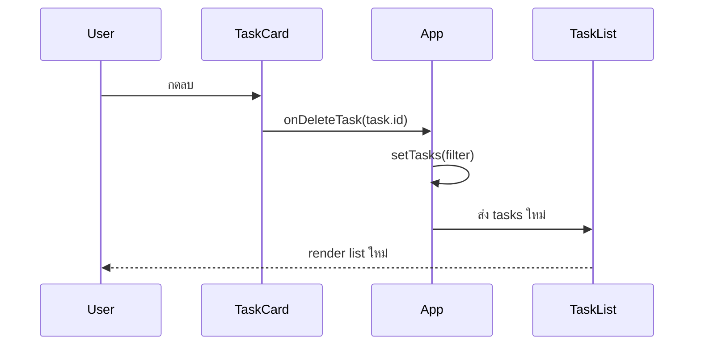

# 07 — List, Key และ Conditional Rendering

## เป้าหมาย

ผู้เรียนสามารถ render array ด้วย `map()`, ใช้ stable key, กรองรายการ และแสดง empty/error/success state

## Render List ด้วย `map()`

```jsx
function TaskList({ tasks, onDeleteTask }) {
  return (
    <div className="task-list">
      {tasks.map((task) => (
        <TaskCard
          key={task.id}
          task={task}
          onDeleteTask={onDeleteTask}
        />
      ))}
    </div>
  );
}
```

`map()` แปลง object แต่ละตัวใน array ให้เป็น JSX element

```text
task object → TaskCard JSX
```

## Key คือ Identity

React ใช้ `key` เพื่อรู้ว่า element ใดเป็นรายการเดิม รายการใหม่ หรือรายการที่ถูกลบ

ดี:

```jsx
key={task.id}
```

หลีกเลี่ยง:

```jsx
key={index}
key={Math.random()}
```

เมื่อ list มีการลบ เพิ่ม หรือเรียงใหม่ การใช้ index อาจทำให้ state/focus ของ card สลับไปอยู่ผิดรายการ ส่วน `Math.random()` ทำให้ identity เปลี่ยนทุก render

## Empty State

ก่อน `map()` ให้ตรวจว่า array ว่างหรือไม่:

```jsx
function TaskList({ tasks, onDeleteTask }) {
  if (tasks.length === 0) {
    return (
      <div className="empty-state" role="status">
        <h3>ยังไม่มีรายการในสถานะนี้</h3>
        <p>ลองเปลี่ยนตัวกรองหรือเพิ่มงานใหม่</p>
      </div>
    );
  }

  return (
    <div className="task-list">
      {tasks.map((task) => (
        <TaskCard
          key={task.id}
          task={task}
          onDeleteTask={onDeleteTask}
        />
      ))}
    </div>
  );
}
```

Empty state ควรบอกทั้งสถานการณ์และ next action ไม่ควรปล่อยพื้นที่ว่างจนผู้ใช้คิดว่าระบบเสีย

## Filter เป็น Derived Data

```jsx
const filteredTasks =
  statusFilter === 'all'
    ? tasks
    : tasks.filter((task) => task.status === statusFilter);
```

ส่ง `filteredTasks` ไปยัง `TaskList` แต่ Summary ยังคำนวณจาก `tasks` ทั้งหมด

## Conditional Rendering รูปแบบหลัก

Early return:

```jsx
if (tasks.length === 0) {
  return <EmptyState />;
}
```

Ternary:

```jsx
{isSaving ? <p>กำลังบันทึก...</p> : <button>บันทึก</button>}
```

AND:

```jsx
{feedback && <p role="status">{feedback}</p>}
```

เลือกให้เหมาะกับความซับซ้อน ถ้ามีหลายเงื่อนไข ควรคำนวณก่อน `return` แทนการซ้อน ternary หลายชั้น

## ทดลอง Delete

ใน `App`:

```jsx
function handleDeleteTask(taskId) {
  setTasks((currentTasks) =>
    currentTasks.filter((task) => task.id !== taskId),
  );
}
```

Flow:



## Check Understanding

1. `map()` คืนค่าอะไร
2. ทำไม stable key จึงสำคัญเมื่อมีการลบ
3. Summary ควรใช้ `tasks` หรือ `filteredTasks` หากต้องแสดงภาพรวมทั้งหมด

## Mini Challenge

เพิ่มข้อความ:

- “พบ 1 รายการ” เมื่อ filter เหลือหนึ่งรายการ
- “พบ N รายการ” เมื่อมากกว่าหนึ่ง

โดยคำนวณจาก `filteredTasks.length`

## CP02/CP05 Checkpoint

ผ่านเมื่อ:

- [ ] initial tasks 3 รายการ render ด้วย `map()`
- [ ] ใช้ `task.id` เป็น key
- [ ] filter แสดงรายการตรงสถานะ
- [ ] delete ลบตาม id แบบ immutable
- [ ] list ว่างแล้วแสดง empty state
- [ ] count เปลี่ยนตาม state จริง

ต่อไป: [08 — Controlled Form and Validation](./08_CONTROLLED_FORM_VALIDATION_TH.md)
