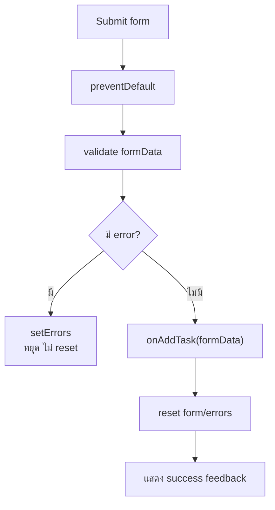

# 08 — Controlled Form และ Validation

## เป้าหมาย

ผู้เรียนสามารถสร้าง form ที่ค่าใน input ถูกควบคุมด้วย state ตรวจความถูกต้อง ป้องกัน submit แบบ reload และส่งข้อมูลที่ valid ไปยัง Parent

## Controlled Form คืออะไร

Input เป็น controlled เมื่อ:

- `value` มาจาก state
- `onChange` อัปเดต state

```jsx
const [title, setTitle] = useState('');

<input
  id="title"
  name="title"
  value={title}
  onChange={(event) => setTitle(event.target.value)}
/>
```

State จึงเป็น single source of truth ของ field

## ใช้ Object Form State

```jsx
const initialForm = {
  title: '',
  category: '',
  priority: 'normal',
};

const [formData, setFormData] = useState(initialForm);
```

Generic change handler:

```jsx
function handleChange(event) {
  const { name, value } = event.target;

  setFormData((current) => ({
    ...current,
    [name]: value,
  }));
}
```

ทุก control ต้องมี `name` ตรงกับ property:

```jsx
<input
  id="title"
  name="title"
  value={formData.title}
  onChange={handleChange}
/>
```

## Validation เป็น Pure Function

```jsx
function validateTask(formData) {
  const errors = {};

  if (formData.title.trim().length < 3) {
    errors.title = 'ชื่องานต้องมีอย่างน้อย 3 ตัวอักษร';
  }

  if (!formData.category) {
    errors.category = 'กรุณาเลือกหมวดหมู่';
  }

  return errors;
}
```

Function นี้:

- รับข้อมูล
- คืน error object
- ไม่แก้ state
- ทดสอบแยกได้ง่าย

## Submit Flow



ตัวอย่าง:

```jsx
function handleSubmit(event) {
  event.preventDefault();

  const nextErrors = validateTask(formData);

  if (Object.keys(nextErrors).length > 0) {
    setErrors(nextErrors);
    setFeedback('');
    return;
  }

  onAddTask(formData);
  setFormData(initialForm);
  setErrors({});
  setFeedback('เพิ่มรายการสำเร็จ');
}
```

## แสดง Error ใกล้ Field

```jsx
<label htmlFor="title">ชื่องาน</label>
<input
  id="title"
  name="title"
  value={formData.title}
  onChange={handleChange}
  aria-invalid={Boolean(errors.title)}
  aria-describedby={errors.title ? 'title-error' : undefined}
/>
{errors.title && (
  <p id="title-error" className="field-error">
    {errors.title}
  </p>
)}
```

Feedback รวม:

```jsx
{feedback && <p role="status">{feedback}</p>}
```

อย่าใช้สีเพียงอย่างเดียว ต้องมีข้อความที่สื่อความหมาย

## Parent รับข้อมูลและเพิ่มแบบ Immutable

```jsx
function handleAddTask(taskData) {
  const newTask = {
    id: `TASK-${Date.now()}`,
    ...taskData,
    status: 'todo',
  };

  setTasks((currentTasks) => [newTask, ...currentTasks]);
}
```

`TaskForm` ไม่จำเป็นต้องรู้ว่า tasks ทั้งหมดมีอะไร หน้าที่คือจัดการ form และส่งข้อมูล valid ผ่าน callback

## กรณี Invalid ต้องไม่ Reset

ถ้าผู้ใช้กรอกบางส่วนแล้วผิด การล้าง form จะทำให้ต้องพิมพ์ใหม่ทั้งหมด จึงควร:

- เก็บค่าที่ผู้ใช้กรอกไว้
- แสดง error เฉพาะจุด
- focus จุดแรกที่ผิดได้ถ้ามีเวลา
- reset เฉพาะเมื่อเพิ่มข้อมูลสำเร็จ

## Mini Challenge

เพิ่ม validation ว่า category ต้องเป็นหนึ่งใน:

```js
['reading', 'coding', 'review']
```

อย่าตรวจเพียงว่าค่าไม่ว่าง

## CP04 — Controlled Form

ผ่านเมื่อ:

- [ ] ทุก field มี `value` และ `onChange`
- [ ] submit เรียก `preventDefault()`
- [ ] title สั้นกว่า 3 ตัวอักษรไม่ถูกเพิ่ม
- [ ] ไม่เลือก category แล้วเห็น error ใกล้ field
- [ ] valid data เพิ่มรายการสถานะ `todo`
- [ ] reset เฉพาะเมื่อ valid
- [ ] feedback มีข้อความและ `role="status"`

ต่อไป: [09 — Guided Build: Study Task Board](./09_STUDY_TASK_BOARD_GUIDED_BUILD_TH.md)
