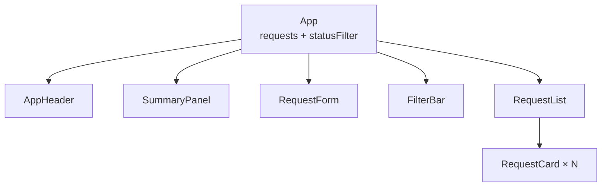

# 10 — Transfer to LAB04: Campus Service Request

## เป้าหมาย

ผู้เรียนสามารถนำ pattern จาก Study Task Board ไปประยุกต์กับ Campus Service Request โดยเปลี่ยน domain, data contract, component contract, validation และ test evidence อย่างมีเหตุผล

## สิ่งที่นำไปใช้ได้ และสิ่งที่ต้องออกแบบใหม่

| Pattern จาก Pre-LAB | LAB04 ที่สอดคล้อง | ต้องออกแบบใหม่ |
|---|---|---|
| `tasks` state | `requests` state | field ตาม Request Data Contract |
| `statusFilter` | `statusFilter` | ค่า status เป็น pending/in-progress/completed |
| `TaskForm` | `RequestForm` | fields และ validation 5 รายการ |
| `TaskList/TaskCard` | `RequestList/RequestCard` | รายละเอียดผู้แจ้ง/สถานที่/priority |
| `onAddTask` | `onAddRequest` | สร้าง `REQ-*` และ pending |
| `onDeleteTask` | `onDeleteRequest` | ส่ง request id |
| Task summary | Request summary | count 4 สถานะ |

การ transfer คือการนำหลักการไปแก้ปัญหาใหม่ ไม่ใช่ค้นหา/แทนคำว่า Task เป็น Request ทั้งไฟล์

## LAB04 Component Contract



ขั้นต่ำต้องมี `App` และ child components 6 ชื่อตามภาพ

## LAB04 Data Contract

```js
{
  id: 'REQ-001',
  requesterName: 'สมชาย ใจดี',
  requestType: 'แจ้งซ่อม',
  location: 'ห้องปฏิบัติการ 301',
  details: 'เครื่องปรับอากาศไม่ทำงาน',
  priority: 'normal',
  status: 'pending',
}
```

ค่าที่อนุญาต:

```text
priority: normal | urgent
status: pending | in-progress | completed
filter: all | pending | in-progress | completed
```

## State Plan

ใน `App`:

```jsx
const [requests, setRequests] = useState(initialRequests);
const [statusFilter, setStatusFilter] = useState('all');
```

Derived data:

```jsx
const summary = {
  total: requests.length,
  pending: requests.filter((request) => request.status === 'pending').length,
  inProgress: requests.filter(
    (request) => request.status === 'in-progress',
  ).length,
  completed: requests.filter(
    (request) => request.status === 'completed',
  ).length,
};
```

อย่าสร้าง state ซ้ำสำหรับ count

## Validation Contract

| Field | กติกา |
|---|---|
| Requester Name | trim แล้วอย่างน้อย 2 ตัวอักษร |
| Request Type | ต้องเลือก |
| Location | trim แล้วไม่ว่าง |
| Details | trim แล้วอย่างน้อย 10 ตัวอักษร |
| Priority | `normal` หรือ `urgent` |

Invalid submit:

- ไม่เพิ่ม request
- ไม่ reset form
- error อยู่ใกล้ field
- มี `aria-invalid`

Valid submit:

- เพิ่ม request ใหม่แบบ immutable
- unique id
- status เริ่มเป็น `pending`
- reset form/errors
- แสดง success feedback

## Transfer Matrix ก่อนเริ่ม Code

เติมตารางนี้ด้วยตนเอง:

| คำถาม | Study Task Board | Campus Service Request |
|---|---|---|
| State หลัก | `tasks` | |
| Object fields | id/title/category/... | |
| Allowed statuses | todo/doing/done | |
| Form fields | title/category/priority | |
| Validation | title ≥ 3, category required | |
| Card แสดง | title/category/status | |
| ID prefix | `TASK-` | |
| Empty message | ไม่มีงานในสถานะนี้ | |

หากเติมตารางไม่ได้ ให้ย้อนกลับไปบท 06–08 ก่อนเริ่ม LAB04

## ลำดับทำ LAB04 ที่แนะนำ

### H0 — Setup

- checkout `main` ล่าสุด
- สร้าง branch `lab/week-04`
- เตรียม `labs/week-04/source/`
- ติดตั้งและรัน starter

### H1 — Structure

- สร้าง component files
- นำ initial requests เข้า App
- render ผ่าน Props

### H2 — State

- เพิ่ม requests/filter state
- คำนวณ summary/filtered list
- เชื่อม delete callback

### H3 — Form

- controlled fields
- validation
- add/reset/feedback

### H4 — UX/Test

- mobile 375px
- keyboard/focus/labels
- TC-01 ถึง TC-10

### H5 — Delivery

- build
- นำ output เข้า `publish/`
- สร้าง Pages Hub
- PR/merge/tag/evidence

## ห้ามใช้ Pattern เหล่านี้

```jsx
document.querySelector(...)
element.innerHTML = ...
requests.push(...)
requests.splice(...)
key={index}
onClick={handleDelete(id)}
```

ให้ใช้ state, immutable array methods, stable id และ function reference/callback

## Check Understanding

1. ทำไม `TaskForm` จึง copy ไปใช้ตรง ๆ ไม่ได้
2. `RequestCard` ควรเปลี่ยน requests state เองหรือไม่
3. หาก summary ไม่เปลี่ยนหลังเพิ่ม request ควรตรวจจุดใดก่อน

## Definition of Ready for LAB04

- [ ] เติม Transfer Matrix ครบ
- [ ] วาด component/data flow ได้
- [ ] ระบุ state และ derived data ได้
- [ ] เขียน validation rules เป็นข้อความก่อนเขียน code
- [ ] Pre-LAB `npm run check` และ `npm run build` ผ่าน

ต่อไป: [11 — Test, Build, Pages and Submission](./11_TEST_BUILD_PAGES_SUBMISSION_TH.md)
