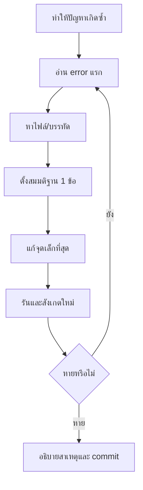

# 12 — React Beginner Troubleshooting

## เป้าหมาย

ผู้เรียนสามารถวิเคราะห์ปัญหา React จากหลักฐานจริง แก้ error แรกก่อน และไม่สุ่มแก้หลายจุดพร้อมกัน

## Debug Loop



เปิดหลักฐาน 3 จุด:

1. Terminal ที่รัน Vite
2. Browser Console
3. Browser Network เมื่อสงสัย asset/path

## 1. หน้าเปล่าหลังแก้ JSX

ตรวจ error แรก เช่น:

- tag ปิดไม่ครบ
- root มากกว่าหนึ่ง
- `{` หรือ `}` ขาด
- import path ผิด
- export/import ไม่ตรง

วิธีแก้:

1. undo การแก้ล่าสุด
2. ให้หน้า render กลับมาก่อน
3. เพิ่มโค้ดทีละส่วน

## 2. `X is not defined`

ตรวจ:

- สะกดชื่อตัวแปร
- scope
- import
- destructuring Props

```jsx
function TaskCard({ task }) {
  return <h3>{task.title}</h3>;
}
```

หากเขียน `{title}` แต่ไม่ได้ destructure `title` จะเกิด error

## 3. `Invalid hook call` หรือ Hook ใช้ไม่ได้

กฎพื้นฐาน:

- เรียก Hook ที่ top level ของ component
- ไม่เรียกใน `if`, loop หรือ nested function
- ชื่อ component ขึ้นต้นตัวพิมพ์ใหญ่

ผิด:

```jsx
if (isReady) {
  const [tasks, setTasks] = useState([]);
}
```

ถูก:

```jsx
const [tasks, setTasks] = useState([]);

if (!isReady) {
  return <p>ยังไม่พร้อม</p>;
}
```

## 4. กดปุ่มแล้ว function ทำงานทันทีตอนเปิดหน้า

ผิด:

```jsx
<button onClick={handleDelete(task.id)}>ลบ</button>
```

ถูก:

```jsx
<button onClick={() => handleDelete(task.id)}>ลบ</button>
```

## 5. เปลี่ยน array แล้ว UI ไม่เปลี่ยน

ตรวจ mutation:

```jsx
tasks.push(newTask);
setTasks(tasks);
```

แก้:

```jsx
setTasks((currentTasks) => [newTask, ...currentTasks]);
```

## 6. Form พิมพ์ไม่ได้

หากมี `value` แต่ไม่มี `onChange` field จะเป็น read-only

```jsx
<input
  value={formData.title}
  onChange={(event) =>
    setFormData((current) => ({
      ...current,
      title: event.target.value,
    }))
  }
/>
```

## 7. Submit แล้วหน้า reload

เพิ่ม:

```jsx
function handleSubmit(event) {
  event.preventDefault();
  // validate และ add
}
```

และ:

```jsx
<form onSubmit={handleSubmit}>
```

## 8. List warning เรื่อง Key

ให้ element ชั้นนอกสุดใน `map()` มี stable key:

```jsx
{tasks.map((task) => (
  <TaskCard key={task.id} task={task} />
))}
```

อย่าใส่ key ภายใน `TaskCard` อย่างเดียว

## 9. Filter ถูก แต่ Summary ผิด

ตรวจว่า:

- Summary คำนวณจาก `tasks`
- List คำนวณจาก `filteredTasks`
- ไม่เก็บ count เป็น state ซ้ำ

## 10. Validation แสดง แต่ยังเพิ่มข้อมูล

หลัง `setErrors(nextErrors)` ต้อง `return`

```jsx
if (Object.keys(nextErrors).length > 0) {
  setErrors(nextErrors);
  return;
}
```

## 11. Development ใช้ได้ แต่ Pages ขาว/404

ตรวจ:

1. `vite.config.js` ใช้ `base: './'`
2. `npm run build` ผ่าน
3. นำ `dist/` เข้า `labs/week-04/publish/`
4. `npm run build:pages`
5. เปิด `docs/labs/week-04/index.html`
6. Network ไม่มี asset 404

อย่าทดสอบเฉพาะ development server

## 12. CSS ไม่ทำงาน

ตรวจ:

- `main.jsx` import `./styles.css`
- ชื่อ `className` ตรงกับ selector
- path และตัวพิมพ์เล็ก/ใหญ่
- rule ไม่ถูก override ใน DevTools

## 13. ใช้ Checkpoint Recovery

เมื่อหลุดจากกิจกรรม:

1. commit/stash งานปัจจุบันถ้าจำเป็น
2. เปรียบเทียบกับ checkpoint ก่อนหน้า
3. ระบุ diff ที่ทำให้เสีย
4. restore เฉพาะไฟล์ที่เกี่ยวข้อง
5. อธิบายสิ่งที่นำกลับมา
6. ทำ checkpoint ปัจจุบันต่อ

เป้าหมายไม่ใช่ให้หน้า “ดูเหมือนเฉลย” แต่ให้กลับเข้าสู่เส้นทางเรียนพร้อมเข้าใจสาเหตุ

## Template สำหรับขอความช่วยเหลือ

```text
กำลังทำ: CP__
คำสั่งที่รัน:
ผลที่คาดหวัง:
ผลที่เกิดจริง:
Error แรกจาก Terminal/Console:
ไฟล์และบรรทัด:
สิ่งที่ลองแล้ว:
สมมติฐานของฉัน:
```

การให้ข้อมูลรูปแบบนี้ทำให้อาจารย์ เพื่อน หรือ AI ช่วยวิเคราะห์ได้ตรงจุด

## Final Self-check

- [ ] ฉันอ่าน error แรกก่อน
- [ ] ฉันแก้ทีละสมมติฐาน
- [ ] ฉันทดสอบ development และ production
- [ ] ฉันอธิบาย state/data flow ได้
- [ ] ฉันตรวจ Console/Network
- [ ] ฉันเข้าใจโค้ดที่นำจากตัวอย่างหรือ AI

กลับไป: [00 — Start Here](./00_START_HERE_REACT_BEGINNER_TH.md)
