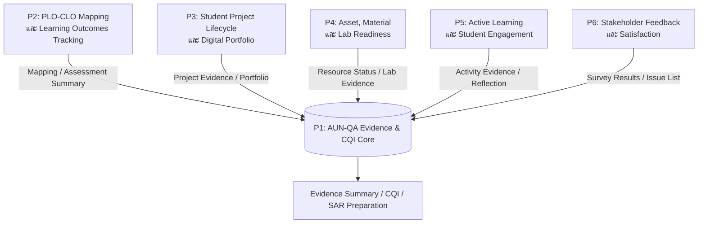

# Project Topic Catalog 1/2569
## ชุดหัวข้อโครงงานระบบนิเวศดิจิทัลเพื่อการบริหารหลักสูตรวิศวกรรมซอฟต์แวร์และหลักฐานคุณภาพ AUN-QA

**สำหรับ:** นักศึกษาวิศวกรรมซอฟต์แวร์ ชั้นปีที่ 2 ห้อง Sec 2  
**ภาคเรียน:** 1/2569  
**สถานะเอกสาร:** ร่างฉบับภาพรวมเพื่อพิจารณาหัวข้อและแบ่งกลุ่ม  
**วัตถุประสงค์ของเอกสาร:** ใช้ประกาศ/อธิบายชุดโจทย์โครงงานหลัก 6 โครงการก่อนจัดทำรายละเอียดเชิงลึกของแต่ละโครงการ

---

## 1. ที่มาและแนวคิดของชุดโครงงาน

หลักสูตรวิศวกรรมซอฟต์แวร์มีความต้องการระบบสารสนเทศที่ช่วยให้การบริหารหลักสูตร การจัดการเรียนรู้ การติดตามทรัพยากร และการเก็บหลักฐานคุณภาพสามารถดำเนินได้ต่อเนื่องตลอดปีการศึกษา ไม่ใช่รวบรวมเอกสารเฉพาะช่วงก่อนการประเมินเท่านั้น

ชุดหัวข้อโครงงานนี้จึงกำหนดให้ **AUN-QA เป็นกรอบกำกับคุณภาพและศูนย์กลางของหลักฐาน** ขณะที่แต่ละโครงการเป็นระบบย่อยที่แก้ปัญหาการใช้งานจริงของหลักสูตร เช่น การวัดผลลัพธ์การเรียนรู้ การจัดการโครงงานนักศึกษา การจัดการครุภัณฑ์ การจัดกิจกรรม และการรับฟังเสียงสะท้อนของผู้มีส่วนได้ส่วนเสีย

> **หลักการสำคัญ:** แต่ละโครงการต้องพัฒนาและส่งมอบได้อย่างอิสระ แต่สามารถส่งออกข้อมูลหรือหลักฐานที่มีมาตรฐานกลับเข้าสู่ศูนย์กลาง AUN-QA ได้ในระยะต่อไป

---

## 2. วัตถุประสงค์ของ Project Topic Catalog

1. กำหนดหัวข้อโครงงานที่เชื่อมโยงกับปัญหาและงานจริงของหลักสูตร
2. เปิดโอกาสให้แต่ละกลุ่มพัฒนาเป็นระบบย่อยที่มีขอบเขตชัดเจนและส่งมอบได้จริง
3. วางแนวทางให้ระบบย่อยสร้างข้อมูลและหลักฐานสนับสนุนการประกันคุณภาพตาม AUN-QA
4. ส่งเสริมการเรียนรู้แบบ Software Engineering Lifecycle ตั้งแต่การวิเคราะห์ความต้องการ ออกแบบ พัฒนา ทดสอบ และนำเสนอ
5. สร้างฐานสำหรับต่อยอดสู่รายวิชาโครงงานในปีถัดไป หรือใช้เป็นต้นแบบของระบบจริงของหลักสูตร

---

## 3. ภาพรวมระบบนิเวศโครงงาน

### 3.1 แนวทางความสัมพันธ์ระหว่างโครงการ

| รหัส | บทบาทหลัก | ข้อมูลหรือหลักฐานที่สามารถส่งต่อเข้าสู่ศูนย์กลาง |
|---|---|---|
| P1 | ศูนย์กลางหลักฐานและแผนปรับปรุง | Evidence status, gap list, CQI action, evidence export |
| P2 | ศูนย์กลาง OBE และผลลัพธ์การเรียนรู้ | Curriculum mapping, CLO coverage, assessment summary |
| P3 | ศูนย์กลางข้อมูลโครงงานและ portfolio | Proposal, progress, meeting log, repository/demo links |
| P4 | ศูนย์กลางทรัพยากรการเรียนรู้ | Asset status, material usage, maintenance, lab readiness |
| P5 | ศูนย์กลางกิจกรรมและการมีส่วนร่วม | Attendance, activity evidence, reflection, engagement report |
| P6 | ศูนย์กลางเสียงสะท้อนและความพึงพอใจ | Survey results, issue list, recommendations, CQI input |

---

## 4. ข้อกำหนดร่วมของทุกโครงการ

ทุกทีมควรออกแบบระบบโดยคำนึงถึงหลักต่อไปนี้

1. **ใช้ได้จริง:** มีผู้ใช้จริงอย่างน้อยหนึ่งกลุ่ม และมี workflow ที่ช่วยลดงานหรือแก้ปัญหาได้จริง
2. **แยกส่งได้:** ระบบมีฐานข้อมูล หน้าจอ และฟังก์ชันหลักของตนเอง ไม่ต้องรอระบบอื่นจึงจะใช้งานได้
3. **เชื่อมต่อได้:** เตรียมแนวทางส่งออกข้อมูลเป็น CSV หรือ JSON และระบุจุดเชื่อมต่อ API ที่สามารถทำในระยะถัดไป
4. **ตรวจสอบได้:** ข้อมูลสำคัญควรมีผู้บันทึก วันที่ สถานะ และประวัติการดำเนินงานตามความเหมาะสม
5. **รองรับ AUN-QA:** ระบุได้ว่าระบบช่วยสร้างหลักฐานหรือข้อมูลเพื่อสนับสนุนเกณฑ์ใดบ้าง
6. **ไม่ขยายขอบเขตเกินจำเป็น:** ภาคเรียนแรกควรเน้นระบบแกนกลางและ workflow สำคัญก่อน ไม่จำเป็นต้องทำทุกฟังก์ชันของระบบจริงให้ครบทั้งหมด

### 4.1 แนวคิด Evidence Package เบื้องต้น

ระบบแต่ละโครงการอาจเตรียมส่งข้อมูลในรูปแบบมาตรฐานกลาง เช่น

| Field | ความหมาย |
|---|---|
| `source_system` | รหัสระบบต้นทาง เช่น P2 หรือ P5 |
| `record_id` | รหัสรายการในระบบต้นทาง |
| `title` | ชื่อรายการ หลักฐาน หรือรายงาน |
| `academic_year` | ปีการศึกษา / ภาคเรียนที่เกี่ยวข้อง |
| `related_plo_clo` | PLO หรือ CLO ที่เกี่ยวข้อง (ถ้ามี) |
| `aun_criterion` | เกณฑ์ AUN-QA ที่หลักฐานสนับสนุน |
| `file_url_or_reference` | ลิงก์ไฟล์/เอกสาร/รายการอ้างอิง |
| `evidence_status` | สถานะ เช่น Draft, Submitted, Reviewed, Approved |

> ระยะเริ่มต้นให้ใช้ **CSV / JSON Export** ก่อน ส่วน REST API เป็นงานต่อยอดเมื่อโครงสร้างข้อมูลเริ่มนิ่ง

---

# 5. รายละเอียดภาพรวมของ 6 โครงการ

---

## P1. ระบบบริหารหลักฐานคุณภาพและ CQI ตาม AUN-QA
### Thai Title
**ระบบบริหารหลักฐานคุณภาพและแผนปรับปรุงอย่างต่อเนื่องตามแนวทาง AUN-QA สำหรับหลักสูตรวิศวกรรมซอฟต์แวร์**

### English Title
**AUN-QA Quality Evidence and Continuous Quality Improvement Management System for the Software Engineering Programme**

### ปัญหา
ข้อมูลและหลักฐานที่เกี่ยวข้องกับการประกันคุณภาพมักกระจัดกระจายอยู่ในหลายแหล่ง เช่น เอกสารรายวิชา รายงานกิจกรรม รายงานประชุม แบบประเมิน ภาพถ่าย และลิงก์ไฟล์ออนไลน์ ทำให้ติดตามความครบถ้วนของหลักฐานและสถานะการปรับปรุงได้ยาก โดยเฉพาะเมื่อต้องจัดทำรายงานหรือเตรียมรับการประเมิน

### วัตถุประสงค์
1. จัดเก็บและจัดหมวดหมู่หลักฐานตามเกณฑ์ AUN-QA และบริบทของหลักสูตร
2. ติดตามสถานะของหลักฐาน รวมถึงระบุช่องว่างของข้อมูลที่ยังขาด
3. บริหารรายการปรับปรุงคุณภาพ (CQI Action) ตั้งแต่การกำหนดประเด็น ผู้รับผิดชอบ กำหนดเวลา และผลการดำเนินงาน
4. เตรียมข้อมูลสำหรับนำไปใช้ในการสรุปผลและจัดทำรายงานคุณภาพในอนาคต

### ขอบเขตเริ่มต้น
- จัดการปีการศึกษา เกณฑ์ AUN-QA และรายการหลักฐาน
- อัปโหลดไฟล์หรือบันทึกลิงก์หลักฐาน
- Tag หลักฐานตาม Criterion / Sub-criterion / รายวิชา / กิจกรรม / PLO ตามความเหมาะสม
- Workflow สถานะหลักฐาน: Draft → Submitted → Reviewed → Approved / Revision
- Gap List แสดงรายการหลักฐานที่ยังไม่ครบ
- CQI Action List และการติดตามสถานะ
- ส่งออก Evidence Summary อย่างน้อยหนึ่งรูปแบบ

### ผู้ใช้หลัก
- คณะกรรมการบริหารหลักสูตร
- อาจารย์ผู้สอนและผู้รับผิดชอบรายวิชา
- ผู้รับผิดชอบงานประกันคุณภาพ
- ผู้ตรวจทานหลักฐานภายใน

### ฟังก์ชัน MVP
1. Evidence Repository และการค้นหา
2. Evidence Tagging
3. Evidence Workflow
4. Gap Dashboard
5. CQI Action Tracking
6. Export Evidence Summary / CSV

### ความเชื่อมโยง AUN-QA
- สนับสนุนการจัดการหลักฐานในทุก Criterion 1–8
- สนับสนุนวงจร PDCA และการติดตาม CQI
- เป็นฐานข้อมูลประกอบ SAR ในระยะต่อไป

### ผลลัพธ์ที่นักศึกษาต้องส่งในปลายภาค
- SRS และ Use Case ของกระบวนการจัดการหลักฐานและ CQI
- ER Diagram และ Data Dictionary เบื้องต้น
- Wireframe / Prototype สำหรับ Evidence Workbench
- MVP ที่มี workflow อย่างน้อย: เพิ่มหลักฐาน → ส่งตรวจ → ตรวจทาน → อนุมัติ/ตีกลับ
- ตัวอย่าง Gap List และ CQI Action List
- Test Case / Test Report สำหรับ workflow หลัก
- Source Code, README และ Demo Video

---

## P2. ระบบ PLO-CLO Mapping และการติดตามผลลัพธ์การเรียนรู้
### Thai Title
**ระบบบริหารความเชื่อมโยง PLO-CLO และการติดตามผลลัพธ์การเรียนรู้สำหรับหลักสูตรวิศวกรรมซอฟต์แวร์**

### English Title
**PLO-CLO Mapping and Learning Outcomes Tracking System for the Software Engineering Programme**

### ปัญหา
การบริหารหลักสูตรแบบ Outcome-Based Education ต้องแสดงความเชื่อมโยงระหว่างผลลัพธ์การเรียนรู้ระดับหลักสูตร (PLO) ผลลัพธ์การเรียนรู้ระดับรายวิชา (CLO) รายวิชา วิธีประเมิน และผลการประเมิน แต่ข้อมูลดังกล่าวมักกระจัดกระจายและตรวจสอบความครอบคลุมได้ยาก

### วัตถุประสงค์
1. จัดเก็บ PLO, Sub-PLO, CLO และข้อมูลรายวิชาที่เกี่ยวข้องอย่างเป็นระบบ
2. สร้าง Curriculum Mapping ระหว่าง PLO ↔ CLO ↔ รายวิชา
3. แสดงระดับความรับผิดชอบของรายวิชา เช่น Introduce / Reinforce / Mastery
4. ตรวจสอบช่องว่างของการสนับสนุน PLO และ CLO
5. เตรียมข้อมูลเชื่อมโยงกับวิธีประเมินและการวิเคราะห์ attainment ในอนาคต

### ขอบเขตเริ่มต้น
- จัดการข้อมูลหลักสูตร รายวิชา PLO Sub-PLO และ CLO
- สร้าง Mapping Matrix ระหว่าง PLO, CLO และรายวิชา
- ระบุระดับ I / R / M
- ผูกวิธีประเมินหรือชิ้นงานประเมินกับ CLO
- แสดงรายงาน Coverage และ Mapping Gap
- ส่งออก Curriculum Map ในรูปแบบ CSV / PDF หรือหน้า dashboard

### ผู้ใช้หลัก
- ประธานหรือคณะกรรมการบริหารหลักสูตร
- อาจารย์ผู้สอน
- ผู้ดูแลวิชาการและงานประกันคุณภาพ

### ฟังก์ชัน MVP
1. PLO / CLO Master Data Management
2. Curriculum Mapping Matrix
3. I-R-M Assignment
4. Assessment-to-CLO Link
5. Coverage / Gap Report
6. Mapping Export

### ความเชื่อมโยง AUN-QA
- Criterion 1: Expected Learning Outcomes
- Criterion 2: Programme Structure and Content
- Criterion 3: Teaching and Learning Approach
- Criterion 4: Student Assessment
- Criterion 8: Output and Outcomes

### ผลลัพธ์ที่นักศึกษาต้องส่งในปลายภาค
- SRS ของข้อมูล PLO/CLO และ Curriculum Mapping
- Use Case, ER Diagram และ Data Dictionary
- Wireframe ของหน้าจอ Mapping Matrix และรายงาน Coverage
- MVP ที่สร้าง PLO/CLO และสร้าง mapping ได้จริง
- ตัวอย่างรายงาน PLO Support Matrix / CLO Coverage Report
- Test Case / Test Report
- Source Code, README และ Demo Video

---

## P3. ระบบบริหารวงจรโครงงานนักศึกษาและแฟ้มสะสมผลงาน
### Thai Title
**ระบบบริหารวงจรโครงงานนักศึกษาและแฟ้มสะสมผลงานดิจิทัลสำหรับหลักสูตรวิศวกรรมซอฟต์แวร์**

### English Title
**Student Project Lifecycle and Digital Portfolio Management System for the Software Engineering Programme**

### ปัญหา
การบริหารโครงงานนักศึกษาตั้งแต่การเสนอหัวข้อ การพิจารณา การแก้ไขข้อเสนอ การนัดหมายอาจารย์ที่ปรึกษา การติดตามความก้าวหน้า และการเก็บผลงานปลายทาง มักใช้เอกสารและช่องทางสื่อสารหลายระบบ ทำให้ข้อมูลไม่ต่อเนื่องและนำมาใช้เป็น portfolio หรือหลักฐานคุณภาพได้ยาก

### วัตถุประสงค์
1. รองรับการเสนอหัวข้อและการอนุมัติหัวข้อโครงงานอย่างเป็นระบบ
2. ติดตามความก้าวหน้าตาม milestone และบันทึกการเข้าพบที่ปรึกษา
3. จัดเก็บเอกสาร ผลงาน และลิงก์ทางเทคนิคของโครงงาน
4. สร้างแฟ้มสะสมผลงานดิจิทัลที่ใช้ต่อยอดในการนำเสนอหรือสมัครงานได้
5. ส่งออกหลักฐานที่เกี่ยวข้องกับการเรียนรู้เชิงโครงงานเข้าสู่ AUN-QA Core ในอนาคต

### ขอบเขตเริ่มต้น
- เสนอหัวข้อโครงงานและแก้ไขข้อเสนอ
- Workflow การตรวจและอนุมัติหัวข้อ
- จัดการบทบาทนักศึกษา อาจารย์ที่ปรึกษา และคณะกรรมการ
- บันทึกการเข้าพบที่ปรึกษาและข้อเสนอแนะ
- กำหนด milestone และติดตามสถานะ
- อัปโหลดเอกสารหรือแนบลิงก์ GitHub / Demo / Video / Poster
- แสดง Digital Portfolio ของโครงงาน

### ผู้ใช้หลัก
- นักศึกษา
- อาจารย์ที่ปรึกษา
- คณะกรรมการโครงงาน
- ผู้ดูแลรายวิชาโครงงาน

### ฟังก์ชัน MVP
1. Topic Proposal Submission
2. Topic Review and Approval Workflow
3. Adviser Meeting Log
4. Milestone Tracking
5. Project Document Repository
6. GitHub / Demo / Video / Poster Link Management
7. Digital Portfolio Page

### ความเชื่อมโยง AUN-QA
- Criterion 3: Teaching and Learning Approach
- Criterion 4: Student Assessment
- Criterion 6: Student Support Services
- Criterion 8: Output and Outcomes

### ผลลัพธ์ที่นักศึกษาต้องส่งในปลายภาค
- SRS และ Process Model ของวงจรโครงงาน
- Use Case, Activity Diagram, ER Diagram และ Wireframe
- MVP อย่างน้อย workflow: เสนอหัวข้อ → อาจารย์ตรวจ → ส่งแก้ไข/อนุมัติ
- หน้าติดตาม milestone และ Portfolio ตัวอย่าง
- ตัวอย่าง Evidence Package ของโครงงาน 1 รายการ
- Test Case / Test Report
- Source Code, README และ Demo Video

---

## P4. ระบบบริหารครุภัณฑ์ วัสดุฝึก และความพร้อมห้องปฏิบัติการ
### Thai Title
**ระบบบริหารครุภัณฑ์ วัสดุฝึก และความพร้อมห้องปฏิบัติการสำหรับหลักสูตรวิศวกรรมซอฟต์แวร์**

### English Title
**Asset, Training Material, and Laboratory Readiness Management System for the Software Engineering Programme**

### ปัญหา
การจัดการครุภัณฑ์ วัสดุฝึก และความพร้อมของห้องปฏิบัติการต้องติดตามข้อมูลหลายด้าน เช่น ทะเบียนครุภัณฑ์ หมายเลขทรัพย์สิน สถานะการใช้งาน การยืมคืน การซ่อมบำรุง ปริมาณวัสดุสิ้นเปลือง และความพร้อมก่อนจัดการเรียนการสอน หากข้อมูลไม่เป็นระบบจะส่งผลต่อการวางแผนทรัพยากร การดูแลรักษา และการจัดทำหลักฐานด้านสิ่งสนับสนุนการเรียนรู้

### วัตถุประสงค์
1. บริหารทะเบียนครุภัณฑ์และวัสดุฝึกการสอนอย่างเป็นระบบ
2. ติดตามสถานะพร้อมใช้ ซ่อม ยืม คืน และคงเหลือของทรัพยากร
3. สนับสนุนการตรวจสอบความพร้อมของห้องปฏิบัติการก่อนใช้งาน
4. สร้างรายงานสำหรับการบริหารทรัพยากรและหลักฐานคุณภาพ
5. ต่อยอดจากระบบบริหารครุภัณฑ์ที่เริ่มพัฒนาไว้แล้ว โดยเลือกขอบเขตที่เหมาะสมกับทีม

### ขอบเขตเริ่มต้น
- ทะเบียนครุภัณฑ์ และวัสดุสิ้นเปลือง
- รหัสทรัพย์สิน / QR Scan / ค้นหา
- บันทึกเบิกจ่าย คืน และคงเหลือของวัสดุฝึก
- สถานะครุภัณฑ์และประวัติซ่อมบำรุง
- Dashboard ความพร้อมห้องปฏิบัติการ
- รายงานเบื้องต้นตามประเภททรัพยากร ห้อง หรือสถานะ

### ผู้ใช้หลัก
- เจ้าหน้าที่ห้องปฏิบัติการ
- อาจารย์ผู้สอน
- ผู้ดูแลครุภัณฑ์
- ผู้ดูแลหลักสูตรหรือผู้บริหารที่เกี่ยวข้อง

### ฟังก์ชัน MVP
1. Asset / Material Register
2. QR Search หรือ Lookup by Asset Code
3. Material Stock In-Out
4. Maintenance History
5. Lab Readiness Checklist
6. Asset / Material Summary Dashboard

### ความเชื่อมโยง AUN-QA
- Criterion 6: Student Support Services (การสนับสนุนผู้เรียน)
- Criterion 7: Facilities and Infrastructure
- สนับสนุน Criterion 3 ในมิติความพร้อมของทรัพยากรเพื่อการจัดการเรียนการสอน

### ผลลัพธ์ที่นักศึกษาต้องส่งในปลายภาค
- SRS โดยระบุขอบเขตที่ต่อยอดจากระบบเดิมอย่างชัดเจน
- ER Diagram / Data Dictionary ของ Asset, Material, Maintenance และ Lab Readiness
- Wireframe และ Prototype ของ workflow หลัก
- MVP อย่างน้อยหนึ่ง workflow เช่น เบิกวัสดุ → อนุมัติ → ตัดสต็อก หรือค้นหาครุภัณฑ์ → ดูสถานะ → บันทึกซ่อม
- Dashboard ความพร้อมหรือรายงานสรุปอย่างน้อย 1 หน้า
- Test Case / Test Report
- Source Code, README และ Demo Video

---

## P5. ระบบบริหาร Active Learning และ Student Engagement
### Thai Title
**ระบบบริหารกิจกรรมการเรียนรู้เชิงรุกและการมีส่วนร่วมของนักศึกษาสำหรับหลักสูตรวิศวกรรมซอฟต์แวร์**

### English Title
**Active Learning and Student Engagement Management System for the Software Engineering Programme**

### ปัญหา
กิจกรรมการเรียนรู้เชิงรุก กิจกรรมเสริมหลักสูตร Workshop Bootcamp Seminar หรือกิจกรรมพัฒนาทักษะมักมีหลักฐานกระจัดกระจาย และยังเชื่อมโยงกับผลลัพธ์การเรียนรู้ ทักษะอ่อน และผลสะท้อนของผู้เรียนได้ไม่ชัดเจน ทำให้ยากต่อการติดตามคุณค่าของกิจกรรมและการนำผลไปปรับปรุงในรอบถัดไป

### วัตถุประสงค์
1. วางแผนและบันทึกกิจกรรม Active Learning หรือกิจกรรมพัฒนานักศึกษาอย่างเป็นระบบ
2. เชื่อมโยงกิจกรรมกับ PLO, CLO, Soft Skill หรือผลลัพธ์ที่คาดหวังตามความเหมาะสม
3. บันทึกการเข้าร่วมและเก็บหลักฐานกิจกรรม
4. รวบรวม reflection และความพึงพอใจจากผู้เรียน
5. สร้างรายงานเพื่อใช้ประเมินและปรับปรุงกิจกรรมในรอบถัดไป

### ขอบเขตเริ่มต้น
- สร้างแผนกิจกรรม วัตถุประสงค์ กลุ่มเป้าหมาย และผลลัพธ์ที่คาดหวัง
- ลงทะเบียนเข้าร่วมกิจกรรม
- QR Check-in / Check-out หรือบันทึกการเข้าร่วม
- แนบภาพถ่าย เอกสาร ลิงก์ หรือหลักฐานกิจกรรม
- แบบสะท้อนผลหลังเข้าร่วมกิจกรรม
- แบบประเมินความพึงพอใจ
- Dashboard การเข้าร่วมและ Reflection Summary

### ผู้ใช้หลัก
- อาจารย์ผู้สอน
- นักศึกษา
- ผู้ประสานงานกิจกรรม
- คณะกรรมการหลักสูตร

### ฟังก์ชัน MVP
1. Activity Plan Management
2. Registration and Attendance Tracking
3. QR Check-in (หรือแนวทาง check-in ที่เหมาะสม)
4. Activity Evidence Upload
5. Reflection Form
6. Satisfaction Survey
7. Engagement Dashboard

### ความเชื่อมโยง AUN-QA
- Criterion 3: Teaching and Learning Approach
- Criterion 6: Student Support Services
- Criterion 8: Output and Outcomes

### ผลลัพธ์ที่นักศึกษาต้องส่งในปลายภาค
- SRS ของระบบกิจกรรมและการเก็บหลักฐานการมีส่วนร่วม
- Use Case, ER Diagram, Activity Flow และ Wireframe
- MVP อย่างน้อย workflow: สร้างกิจกรรม → ลงทะเบียน → check-in → reflection
- ตัวอย่าง Activity Evidence และ Reflection Summary
- Dashboard การเข้าร่วมกิจกรรมอย่างน้อย 1 หน้า
- Test Case / Test Report
- Source Code, README และ Demo Video

---

## P6. ระบบบริหาร Feedback และความพึงพอใจของผู้มีส่วนได้ส่วนเสีย
### Thai Title
**ระบบบริหารข้อมูลสะท้อนกลับและความพึงพอใจของผู้มีส่วนได้ส่วนเสียเพื่อการพัฒนาหลักสูตร**

### English Title
**Stakeholder Feedback and Satisfaction Management System for Programme Improvement**

### ปัญหา
การรับฟังความคิดเห็นจากนักศึกษา ศิษย์เก่า ผู้ใช้บัณฑิต สถานประกอบการ และผู้เกี่ยวข้องอื่นมีความสำคัญต่อการพัฒนาหลักสูตร แต่ข้อมูลจากแบบสอบถาม การสัมภาษณ์ หรือรายงานประชุมมักอยู่ในหลายรูปแบบ ทำให้วิเคราะห์แนวโน้ม สรุปประเด็น และเชื่อมผลกลับไปสู่แผนปรับปรุงได้ไม่ต่อเนื่อง

### วัตถุประสงค์
1. จัดเก็บข้อมูลกลุ่มผู้มีส่วนได้ส่วนเสียและแผนการรับฟังความคิดเห็น
2. สร้างและเผยแพร่แบบสอบถามออนไลน์ตามกลุ่มเป้าหมาย
3. สรุปคะแนนความพึงพอใจและข้อเสนอแนะปลายเปิด
4. จัดหมวดหมู่ประเด็นสะท้อนตาม PLO รายวิชา หลักสูตร หรือสิ่งสนับสนุนการเรียนรู้
5. ส่งต่อ Issue List และข้อเสนอแนะเข้าสู่กระบวนการ CQI

### ขอบเขตเริ่มต้น
- Stakeholder Directory
- Survey Template และการสร้างแบบสอบถาม
- การเก็บคำตอบแบบสอบถามออนไลน์
- Dashboard ผลคะแนนและคำตอบปลายเปิด
- Issue Categorization
- Recommendation / Issue List Export
- บันทึกการส่งต่อประเด็นเข้าสู่ CQI

### ผู้ใช้หลัก
- คณะกรรมการบริหารหลักสูตร
- ผู้รับผิดชอบงาน QA
- ผู้ประสานงานหลักสูตร
- ผู้ดูแลแบบสำรวจ
- ผู้มีส่วนได้ส่วนเสียที่ตอบแบบสอบถาม

### ฟังก์ชัน MVP
1. Stakeholder Management
2. Survey Builder แบบกำหนดคำถามพื้นฐาน
3. Survey Distribution Link
4. Response Dashboard
5. Open-ended Feedback Categorization
6. Issue List and Recommendation Export

### ความเชื่อมโยง AUN-QA
- Criterion 1: Expected Learning Outcomes (ความต้องการ stakeholder)
- Criterion 2: Programme Structure and Content
- Criterion 6: Student Support Services
- Criterion 8: Output and Outcomes / Satisfaction / Improvement

### ผลลัพธ์ที่นักศึกษาต้องส่งในปลายภาค
- SRS ของระบบบริหารข้อมูล stakeholder และแบบสำรวจ
- Use Case, ER Diagram, Data Dictionary และ Wireframe
- MVP อย่างน้อย workflow: สร้างแบบสอบถาม → เผยแพร่ → รับคำตอบ → สรุปผล
- ตัวอย่าง Satisfaction Report และ Issue List
- แนวทางส่งออกข้อมูลเพื่อใช้เป็น CQI Input
- Test Case / Test Report
- Source Code, README และ Demo Video

---

## 6. ชุดผลส่งมอบขั้นต่ำร่วมกันในปลายภาค

เพื่อให้ผลงานของแต่ละทีมมีมาตรฐานร่วมกัน ทุกโครงการควรส่งมอบอย่างน้อยดังนี้

| หมวด | ผลส่งมอบขั้นต่ำ |
|---|---|
| วิเคราะห์ปัญหา | Problem Statement, Stakeholder, Scope และข้อจำกัด |
| เอกสารความต้องการ | SRS ฉบับย่อ หรือ Software Requirements Specification ที่ครอบคลุม workflow หลัก |
| การออกแบบ | Use Case Diagram, Activity Diagram สำคัญ, ER Diagram, Data Dictionary, Wireframe |
| ระบบต้นแบบ | MVP ที่ใช้งานได้จริงอย่างน้อย 1 end-to-end workflow |
| คุณภาพซอฟต์แวร์ | Test Case, Test Result และการจัดการข้อผิดพลาดพื้นฐาน |
| การส่งต่อระบบ | Source Code, README, วิธีติดตั้ง/ทดสอบ, ตัวอย่างข้อมูลทดสอบ |
| การสื่อสารผลงาน | Slide/Poster, Demo Video และการนำเสนอปลายภาค |
| การเชื่อมระบบนิเวศ | ตัวอย่าง Evidence Package หรือ CSV/JSON Export อย่างน้อย 1 ชุด |

> **หมายเหตุ:** ภาคเรียน 1/2569 ให้เน้น “ความถูกต้องของปัญหา การออกแบบที่ดี และ MVP ที่พิสูจน์ workflow สำคัญ” ก่อนการพัฒนาระบบให้ครบทุกฟังก์ชันในระดับ production

---

## 7. แนวทางแบ่งกลุ่มตามจำนวนนักศึกษา

| จำนวนกลุ่ม | ข้อเสนอการจัดหัวข้อ |
|---:|---|
| 4 กลุ่ม | กลุ่ม 1: P1+P2, กลุ่ม 2: P3, กลุ่ม 3: P4, กลุ่ม 4: P5+P6 |
| 5 กลุ่ม | แยก P1, P2, P3, P4 และรวม P5+P6 |
| 6 กลุ่ม | แยกดำเนินการตาม P1–P6 กลุ่มละ 1 โครงการ |
| มากกว่า 6 กลุ่ม | ใช้ P1–P6 เป็นโครงการหลัก และแตก sub-module เช่น E-Appeal, WiL Tracker, Lecturer Profile, KPI Dashboard |

---

## 8. เกณฑ์คำถามที่ทุกทีมต้องตอบก่อนเสนอหัวข้อ

ทุกกลุ่มควรตอบคำถามต่อไปนี้ให้ชัดเจนในการนำเสนอหัวข้อ

1. **ระบบช่วยผู้ใช้จริงอย่างไร และผู้ใช้คือใคร?**
2. **ระบบสร้างข้อมูลหรือหลักฐานที่สนับสนุน AUN-QA ข้อใด?**
3. **ระบบสามารถส่งข้อมูลหรือหลักฐานต่อไปยัง AUN-QA Core ได้อย่างไร?**
4. **MVP ที่ทำเสร็จในภาคเรียนนี้คือ workflow ใด?**
5. **ขอบเขตใดที่ตั้งใจเลื่อนไปทำในระยะต่อไป?**

---

## 9. เอกสารอ้างอิงสำหรับการพัฒนารายละเอียดระยะถัดไป

1. หลักสูตรวิศวกรรมศาสตรบัณฑิต สาขาวิชาวิศวกรรมซอฟต์แวร์ (หลักสูตรใหม่ พ.ศ. 2566)
2. รายงานการประเมินคุณภาพการศึกษาภายในระดับหลักสูตร ตามเกณฑ์ AUN-QA V.4.0
3. แผนพัฒนาคุณภาพจากผลการประเมินคุณภาพการศึกษาภายในระดับหลักสูตร
4. คู่มือปฏิบัติงานประกันคุณภาพการศึกษาตามแนวทาง AUN-QA Version 4.0
5. เอกสารวิเคราะห์และออกแบบสถาปัตยกรรมระบบบริหารจัดการประเมินคุณภาพหลักสูตร (AUN-QA V.4.0)
6. เอกสารระบบบริหารจัดการประเมินคุณภาพหลักสูตร และ AUN-QA QA Platform Masterplan

---

## 10. ข้อเสนอเพื่อดำเนินการต่อ

เอกสารฉบับนี้เป็นแคตตาล็อกระดับภาพรวม หลังจากพิจารณาเลือกว่าจะเปิดหัวข้อใดในภาคเรียน 1/2569 ควรจัดทำเอกสารย่อยรายโครงการต่อไป โดยแต่ละโครงการจะมีอย่างน้อย

- Project Brief
- Problem and Stakeholder Analysis
- Business Rules
- Detailed Scope and Out of Scope
- Use Case Specification
- Initial Data Model
- UI Flow / Wireframe
- MVP Backlog และแผนงานรายสัปดาห์
- Acceptance Criteria และแนวทางทดสอบ

